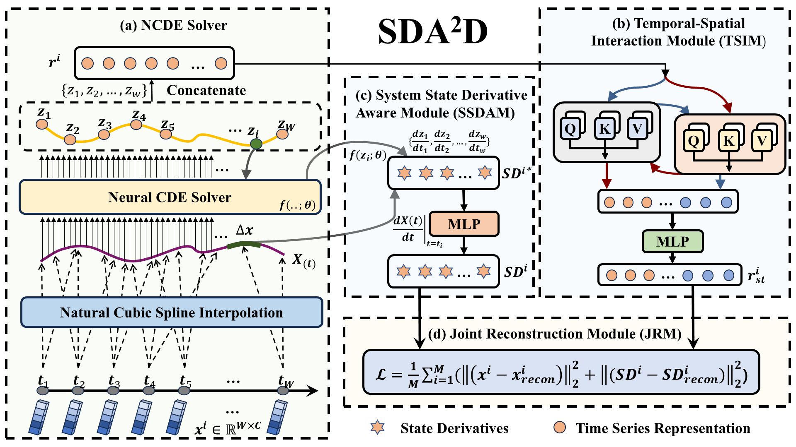

# State-Derivative-Aware Neural Controlled Differential Equations for Multivariate Time Series Anomaly Detection and Diagnosis
The official repository for SDA2D.



Multivariate time series anomaly detection is a crucial factor in real-world applications but a challenging task due to the complex temporal dependencies and system dynamics. Reconstruction-based methods have made great improvements in recent years. However, we observe an issue these methods are suffering, that they primarily measure deviations in the time points themselves when performing anomaly detection but ignore changes in the dynamic properties of the system. In these cases, they are unable to produce sufficient reconstruction errors to detect anomalies, so some potential abnormal time points caused by the dynamic evolution of the system are missing. To address this problem, we propose a novel method, $\text{SDA}^2\text{D}$, which models system dynamics by the derivative of the NCDE-derived state vector with respect to time, enabling the learning of reconstruction deviation and system evolution jointly. Our experimental results also show that $\text{SDA}^2\text{D}$ achieves noticeable improvements in four benchmark datasets, and the visualization also provides further instructions for anomaly diagnosis, locating the source of the anomalies.

```python
bash run.sh
```
